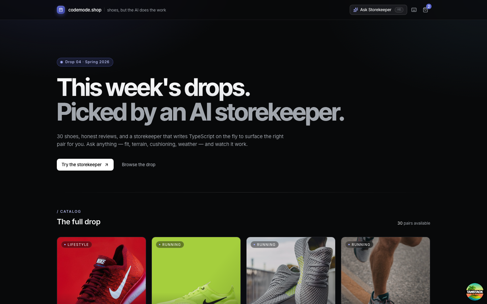
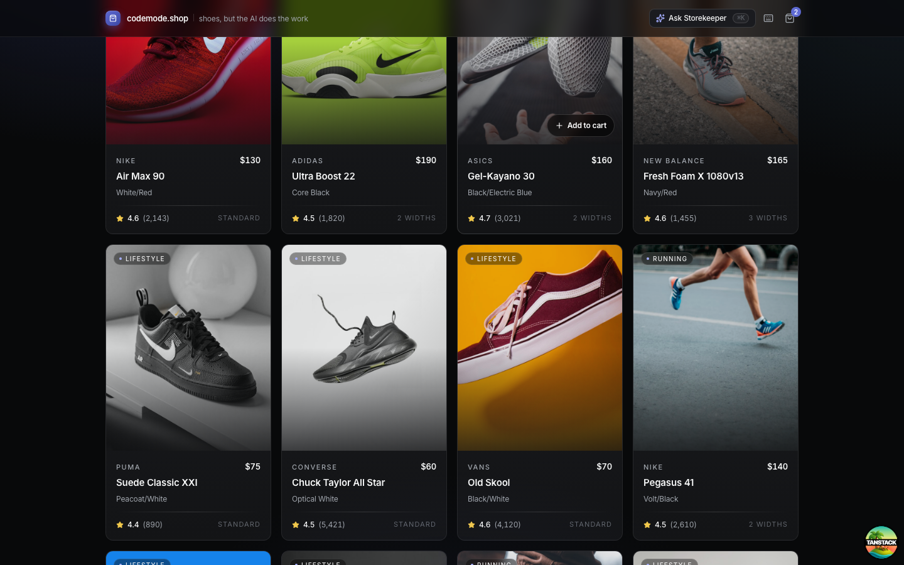
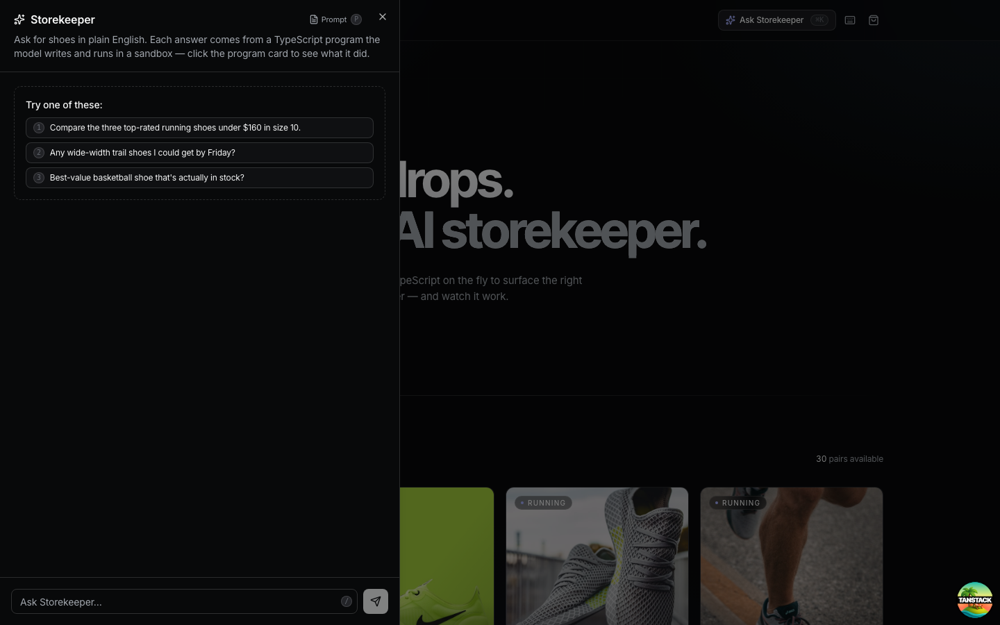
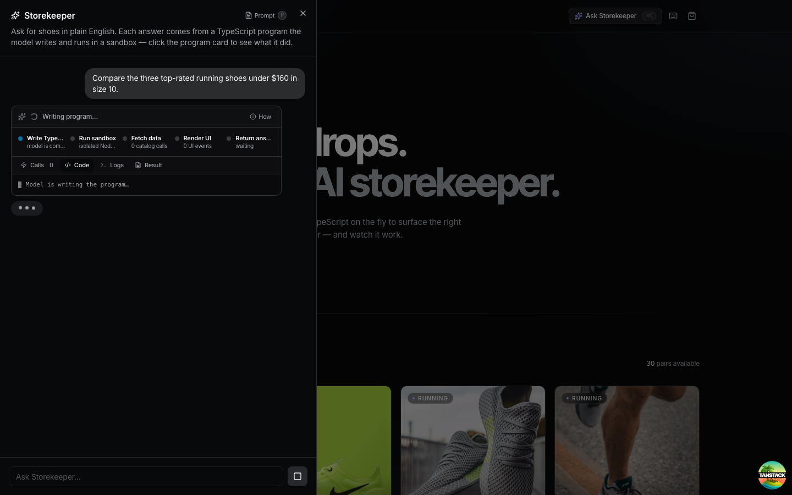
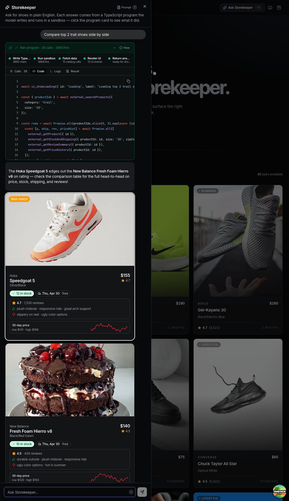
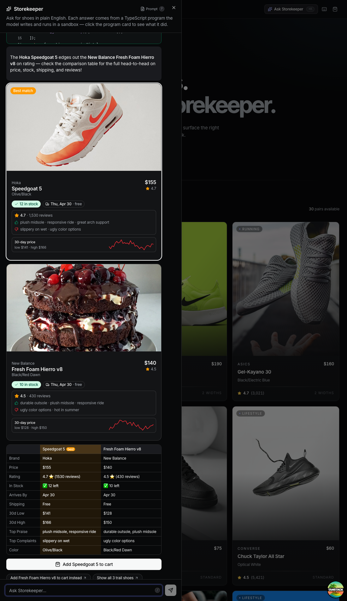
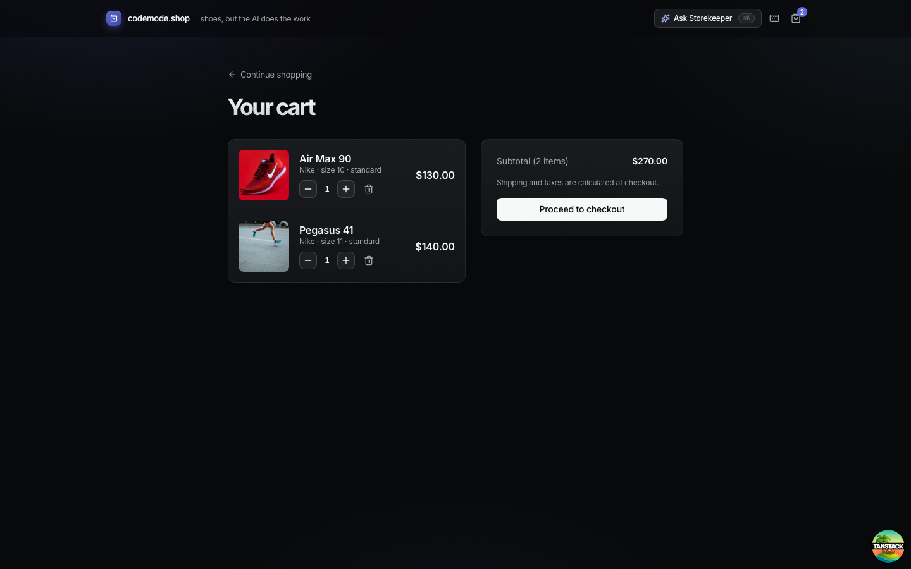
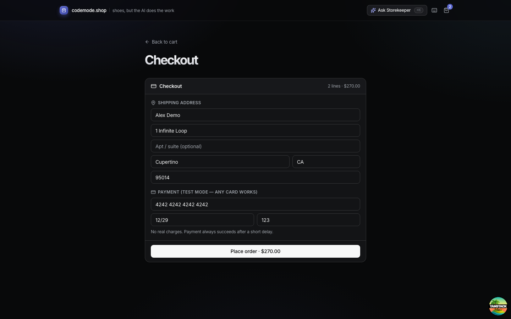

# codemode.shop

A tiny shoe store with one big idea: the shopping assistant writes **TypeScript on the fly** inside a sandbox, and the UI _builds itself_ as the code runs.

Built with TanStack Start, TanStack AI, shadcn/ui, and a QuickJS WASM isolate. The companion project to the blog post _"Code mode, live-rendered: when the LLM writes TypeScript and your UI assembles itself."_



## What you'll see

You land on a small storefront with 30 shoes. The header has an **Ask Storekeeper** button (or `⌘K`).



Open the drawer and you get a chat plus three sample prompts:



Type a prompt — say, _"Compare top 2 trail shoes side by side"_ — and the model writes a TypeScript program. A four-stage pipeline shows what's happening: **Write TypeScript → Run sandbox → Fetch data → Render UI → Return answer.**



While the program runs, UI components stream into the drawer one at a time — product cards, stock pills, review bars, price sparklines:



…then a side-by-side comparison table and a primary CTA:



Click the CTA and the cart badge in the header bumps. From there it's a normal storefront — cart and checkout exist so the AI flow has somewhere to land:





## What "code mode" means here

A traditional tool-calling agent calls `search`, then `getProduct × 5`, then `getStock × 5`, then `getReviews × 5` — roughly 16 round-trips through the LLM, each one a latency tax.

Code mode collapses that to **one** generation: the LLM writes a TypeScript program, it executes in an isolate, and only the final answer comes back. Parallelism via `Promise.all`, filtering, ranking — all in code.

This repo adds one more trick: the sandboxed code can call a closed vocabulary of **UI primitives** (`ui_addProductCard`, `ui_addComparisonTable`, `ui_addCTA`, …). Each call emits a typed event through the SSE stream. A client reducer materializes those events into live React components while the program is still running.

## Getting started

```bash
pnpm install
cp .env.example .env      # then put your Anthropic key in it
pnpm dev                  # http://localhost:3000
```

You need an `ANTHROPIC_API_KEY` from <https://console.anthropic.com>. The default model is `claude-haiku-4-5` — cheap and scored top-tier on the TanStack AI code-mode eval.

Click **Ask Storekeeper** in the header and try:

- _"Compare the three top-rated running shoes under $160 in size 10."_
- _"Any wide-width trail shoes I could get by Friday?"_
- _"Best-value basketball shoe that's actually in stock?"_

## Architecture in seven files

The tutorial is structured so each commit / section maps to one concept.

| #   | File                                                                         | Concept                                                                                                                                                                                                                                                        |
| --- | ---------------------------------------------------------------------------- | -------------------------------------------------------------------------------------------------------------------------------------------------------------------------------------------------------------------------------------------------------------- |
| 1   | `src/lib/catalog.ts`                                                         | In-memory catalog (30 shoes, inventory, reviews, price history). No backend.                                                                                                                                                                                   |
| 2   | `src/lib/tools/catalog-tools.ts`                                             | Headless TanStack AI tools: `searchProducts`, `getProduct`, `getStockAndShipping`, `getReviewSummary`, `getPriceHistory`, `addToCart`. These are the "external API surface" the sandboxed LLM code can call.                                                   |
| 3   | `src/routes/api.storefront-agent.ts`                                         | The server endpoint. `createCodeMode({ driver: createQuickJSIsolateDriver(), tools: catalogTools, getSkillBindings: … })` + Anthropic adapter + SSE.                                                                                                           |
| 4   | `src/lib/storefront/ui-bindings.ts`                                          | The closed **UI vocabulary** the sandbox can render: `ui_addProductCard`, `ui_addStockPill`, `ui_addPriceSparkline`, `ui_addReviewBar`, `ui_addComparisonTable`, `ui_addCTA`, plus `ui_update`/`ui_remove`. Each binding emits a `storefront:ui` custom event. |
| 5   | `src/lib/storefront/ui-prompt.ts`                                            | Type-stubs for the UI vocabulary spliced into the system prompt so the LLM codes against a real `declare function …` surface.                                                                                                                                  |
| 6   | `src/lib/storefront/ui-store.ts` + `components/storefront-canvas.tsx`        | Client reducer that turns streamed `UIEvent`s into a tree of React components. `useSyncExternalStore` keeps render-time minimal.                                                                                                                               |
| 7   | `src/routes/api.storefront-handler.ts` + `src/lib/storefront/run-handler.ts` | Interactive CTAs re-enter code mode to verify stock and emit a `cart:update` event that bumps the header badge. Same pattern as the main agent — one tool, one generation, N effects.                                                                          |

## What the LLM actually writes

When you ask the assistant for "black running shoes under $150 in size 10", Claude emits one `execute_typescript` call that looks roughly like:

```typescript
await ui_showLoading({ id: 'l', label: 'Searching black running shoes…' })

const { productIds } = await external_searchProducts({
  category: 'Running',
  colors: ['black'],
  maxPrice: 150,
  size: '10',
})

const rows = await Promise.all(
  productIds.slice(0, 3).map(async (id) => {
    const [p, ship, rev] = await Promise.all([
      external_getProduct({ id }),
      external_getStockAndShipping({ productId: id, size: '10', zipCode: '94107' }),
      external_getReviewSummary({ productId: id }),
    ])
    return { p, ship, rev }
  }),
)

rows.sort((a, b) => b.rev.averageRating / b.p.price - a.rev.averageRating / a.p.price)

await ui_remove({ id: 'l' })

for (const [i, { p, ship, rev }] of rows.entries()) {
  const cardId = `card-${p.id}`
  await ui_addProductCard({
    id: cardId,
    productId: p.id,
    name: p.name,
    brand: p.brand,
    price: p.price,
    imageUrl: p.imageUrl,
    rating: rev.averageRating,
    color: p.color,
    highlight: i === 0,
  })
  await ui_addStockPill({
    id: `pill-${p.id}`,
    parentId: cardId,
    inStock: ship.inStock,
    quantity: ship.quantity,
    arrivesBy: ship.arrivesBy,
    shippingCost: ship.shippingCost,
  })
  await ui_addReviewBar({
    id: `rev-${p.id}`,
    parentId: cardId,
    rating: rev.averageRating,
    reviewCount: rev.reviewCount,
    praise: rev.commonPraise,
    complaints: rev.commonComplaints,
  })
}

const best = rows[0]
await ui_addCTA({
  id: 'cta',
  label: `Add ${best.p.name} to cart`,
  handlerId: 'addToCart',
  payload: { productId: best.p.id, size: '10', quantity: 1 },
  variant: 'primary',
})

return `${best.p.brand} ${best.p.name} — best value at $${best.p.price}.`
```

One generation. ~15 host tool executions. Zero extra round-trips through the model.

## What's intentionally out of scope

- **No skills / no memoization.** The `ai-code-mode-skills` package can turn successful code-mode programs into reusable named tools. That's a great follow-up blog post, not this one.
- **No auth, no persistence.** Cart state is a module-level `Map`. Restart = empty cart.
- **No deployment config.** `pnpm dev` is the finale. TanStack Start deploys fine to Vercel/Cloudflare; add `--add-ons cloudflare` on scaffold if that's your target.
- **No before/after benchmark.** The code-mode win is qualitative — try it yourself and check the network tab.

## Stack

- [TanStack Start](https://tanstack.com/start) — file-based routing, server handlers
- [`@tanstack/ai`](https://www.npmjs.com/package/@tanstack/ai) + [`@tanstack/ai-react`](https://www.npmjs.com/package/@tanstack/ai-react) — chat + streaming + `useChat`
- [`@tanstack/ai-code-mode`](https://www.npmjs.com/package/@tanstack/ai-code-mode) — `execute_typescript` tool + sandbox wiring
- [`@tanstack/ai-isolate-quickjs`](https://www.npmjs.com/package/@tanstack/ai-isolate-quickjs) — WASM isolate (zero native deps)
- [`@tanstack/ai-anthropic`](https://www.npmjs.com/package/@tanstack/ai-anthropic) — Claude adapter
- [shadcn/ui](https://ui.shadcn.com) + Tailwind CSS v4

## License

MIT
