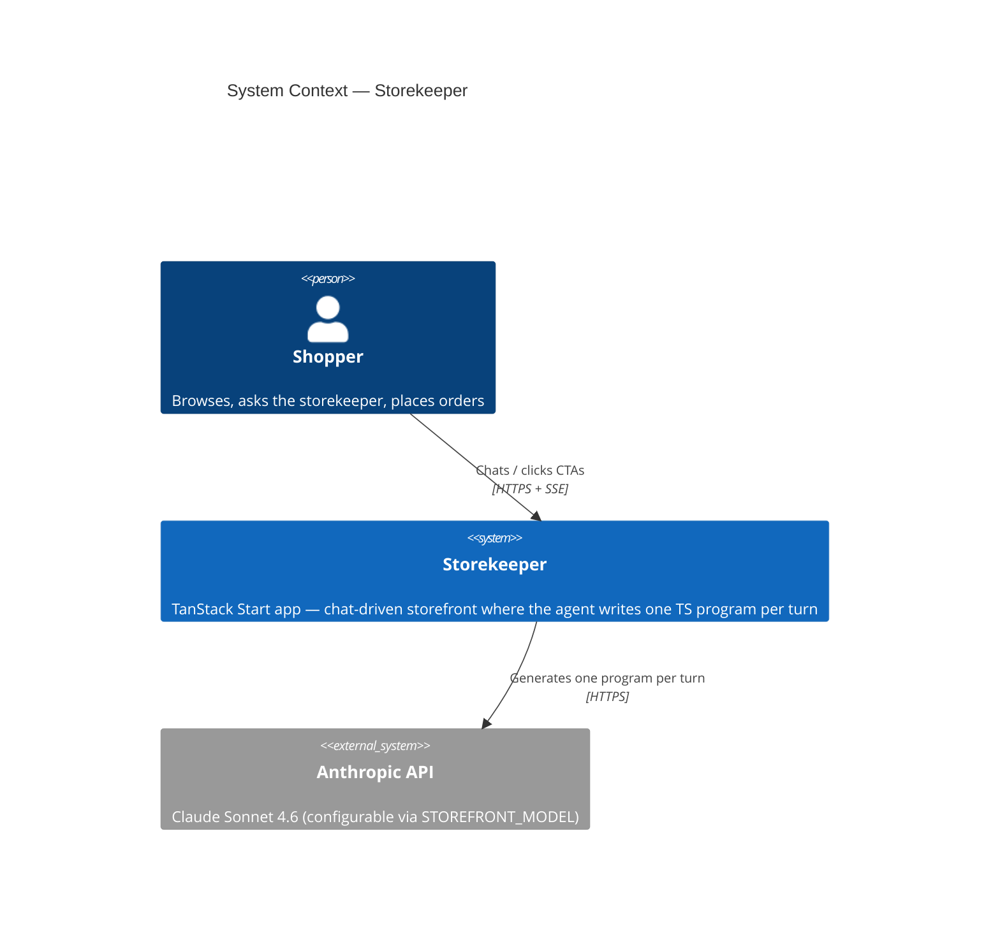
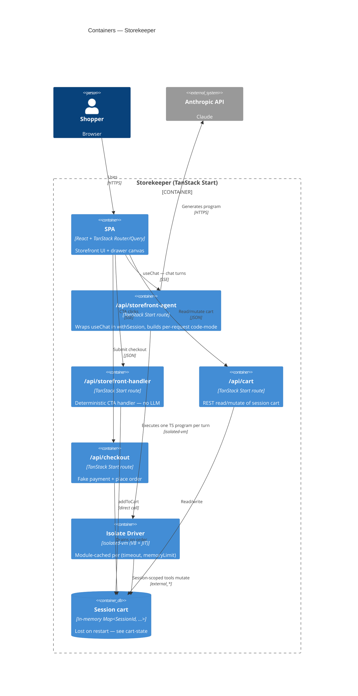
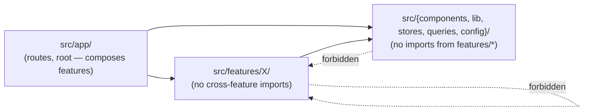

# Architecture diagrams

One visual map of the system. Diagrams render in Obsidian (Mermaid native). Keep them in sync with the prose notes — when [[architecture/request-flow]], [[architecture/code-mode]], or [[architecture/feature-boundaries]] change, update the relevant diagram below.

C4 Context + Container give the big picture. The detailed flows are plain `flowchart` blocks because Mermaid's C4 Dynamic still renders awkwardly.

## System context

Who uses the system and what it talks to.



Linked notes: [[architecture/code-mode]], [[architecture/request-flow]].

## Containers

The deployable / runtime pieces inside the app.



Linked notes: [[architecture/module-cache-pattern]], [[architecture/cart-state]], [[architecture/checkout-flow]], [[architecture/client-server-module-boundary]].

## Chat AI request flow

The numbered steps from [[architecture/request-flow]] — one chat turn end-to-end.

```mermaid
flowchart TD
  click[1. Shopper sends message<br/>storekeeper-drawer.tsx → useChat]
  route[2. /api/storefront-agent<br/>withSession + getStorefrontDriver + buildStorefrontCodeMode]
  llm[Anthropic generates one TS program]
  exec[3. execute_typescript<br/>strip TS → bindings → driver.createContext → run]
  ext[external_* — catalog / cart / orders]
  ui[ui_* — emitCustomEvent 'storefront:ui']
  sse[SSE chunks: CUSTOM + TEXT]
  store[4. uiStore.dispatch — useSyncExternalStore<br/>StorefrontCanvas + renderNode walk tree]
  finish[onFinish: invalidateCart only if turnTouchedCart]

  click --> route --> llm --> exec
  exec -->|tool calls| ext
  exec -->|tool calls| ui
  ext -.->|code_mode:* events| sse
  ui --> sse
  sse --> store
  store --> finish
```

Linked notes: [[architecture/code-mode-execution-pipeline]], [[architecture/custom-events]], [[architecture/tanstack-ai/chat-engine]].

## CTA click flow (no LLM)

The deterministic handler path. No model in the loop — see [[architecture/request-flow]] for why.

```mermaid
flowchart TD
  cta[Shopper clicks CTA in drawer canvas]
  post[POST /api/storefront-handler<br/>handlerId: 'addToCart', payload, zipCode]
  verify[findStock + addToCart server-side]
  emit[Stream SSE frames]
  ui[storefront:ui — flip CTA to 'Added']
  cart[cart:update — full DetailedCart]
  text[TEXT_MESSAGE_CONTENT — toast]
  client[run-handler.ts parses SSE manually<br/>queryClient.setQueryData(cartQueryKey, …)]
  fallback[invalidateCart at stream end if no cart:update]

  cta --> post --> verify --> emit
  emit --> ui
  emit --> cart
  emit --> text
  ui --> client
  cart --> client
  text --> client
  client -.->|safety net| fallback
```

## Feature boundaries

Imports flow one direction. Enforced by `tools/oxlint-plugin-boundaries`.



Linked notes: [[architecture/feature-boundaries]], [[principles/boundary-discipline]].
